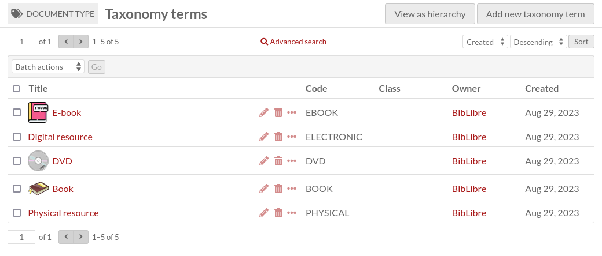

Taxonomy terms
==============

A taxonomy term is an element of a controlled vocabulary. It belongs to a
single taxonomy.

Like a taxonomy, it has a unique (among other taxonomy terms of the same
taxonomy) identifier, called **Code**.

It can have a parent taxonomy term. The parent term must belong to the same
taxonomy. This means that a taxonomy contains a **hierarchy** of terms.

A taxonomy term is also an Omeka S resource (like items, item sets and media),
which means:

* it can be linked to items, item sets and media like any other Omeka S
  resource (it can be linked in annotations too);
* it can be described like any other resource (resource template, class,
  properties, annotations);
* it can have a thumbnail.

List taxonomy terms
-------------------

Taxonomy terms list can be accessed in two different ways:

* by clicking on the tag icon in :ref:`The Taxonomies tab <TaxonomiesTab>`, or
* by clicking on the "View terms" button at the top of the taxonomy page

This page is very similar to `The Items tab
<https://omeka.org/s/docs/user-manual/content/items/#the-items-tab>`_. Please
refer to this documentation for general information.

There are a few differences:

* There is an additional column showing the taxonomy's **Code**.
* Taxonomy terms can be sorted by **Code**.
* There is an additional button at the top of the page to **View (taxonomy terms) as hierarchy**.

View taxonomy terms as hierarchy
--------------------------------

Click on the "View as hierarchy" button to view all your terms as a hierarchy

.. image:: image/taxonomy_terms_browse_hierarchy.png
   :alt: View of a taxonomy terms hierarchy page

Add a taxonomy term
-------------------

To add a new taxonomy term, begin by selecting the the "Add new taxonomy term" button.

Values
~~~~~~

The Values tab is where you enter metadata, such as title, description, etc.

.. image:: image/taxonomy_terms_add_values.png
   :alt: Basic view of add taxonomy term page, with no content entered

It is identical to `The Items Values tab
<https://omeka.org/s/docs/user-manual/content/items/#values>`_.

Taxonomy term
~~~~~~~~~~~~~

The Taxonomy term tab is where you enter the taxonomy term's unique identifier
(**Code**), and where you select a parent term.

Advanced
~~~~~~~~

The Advanced tab is where you can select a thumbnail

.. image:: image/taxonomy_terms_add_advanced.png
   :alt: Basic view of advanced tab, with no content entered
